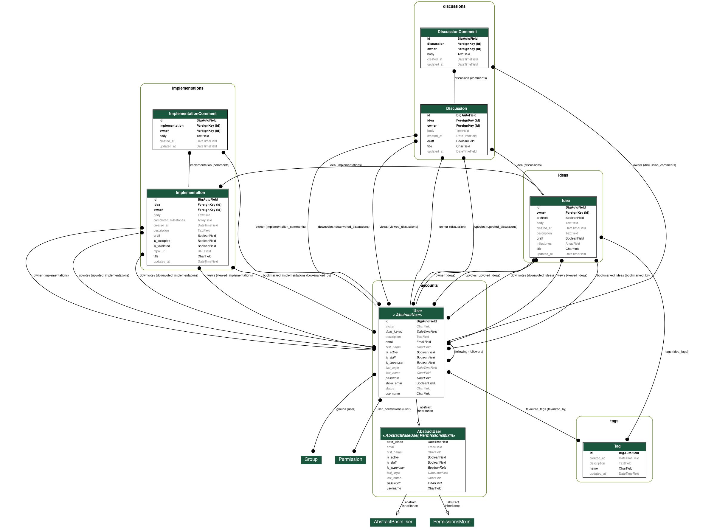

# Flaam-Api

[](https://github.com/flaam-org/flaam-api/actions/workflows/main.yml)

This is the REST api for [Flaam](https://github.com/flaam-org/about). The live version of this api is available at [https://flaam-api.herokuapp.com/api/v1/](https://flaam-api.herokuapp.com/api/v1/).

To view the api documentation, visit [https://flaam-api.herokuapp.com/swagger](https://flaam-api.herokuapp.com/swagger).


## Requirements

- python 3.9+
- postgresql
- [pipenv](https://pipenv.pypa.io/en/latest/)

## Configuration

#### .envrc
##### required
- DATABASE_URL
- EMAIL_HOST
- EMAIL_HOST_USER
- EMAIL_HOST_PASSWORD

##### optional
- DEBUG
- SECRET_KEY
- SENTRY_DSN
- SENTRY_ENV


## Development

#### Requirements

- [direnv](https://direnv.net/)
- [make](https://www.gnu.org/software/make/)

#### Usage

```shell
make init run
```

## Dependencies

- Django
- Django-rest-framework
- PostgreSOL
- [gunicorn](https://docs.gunicorn.org/en/latest/install.html)
- [sentry](https://docs.sentry.io/platforms/python/guides/django/)

[Full list of dependencies](https://github.com/flaam-org/flaam-api/network/dependencies)


### Model Graph


